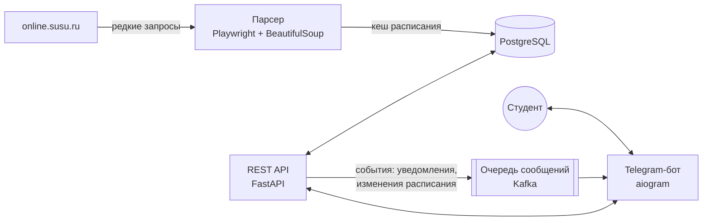

# ЮУрГУ.Пары

Telegram-бот с расписанием пар для студентов ЮУрГУ. Показывает расписание, заранее напоминает о следующей паре и аудитории и позволяет оставлять заметки к занятиям.

> **Статус:** в разработке, этап MVP.
> **Сроки проекта:** 21.09.2026 – 20.12.2026.

Теперь здесь изменяю
ляля
лялял
ялялля
ллаыв

ва
ы
цуа123

## Зачем

Сейчас, чтобы узнать следующую пару и аудиторию, студент каждый раз заходит на online.susu.ru: открывает браузер, авторизуется, ищет нужный день. Уведомлений портал не присылает, а домашние задания и дедлайны приходится записывать отдельно.

Бот переносит расписание в Telegram, которым студент и так пользуется весь день: напоминание приходит само, а заметки привязаны к конкретной паре.

## Возможности

Пользователь один раз указывает свою группу и после этого получает:

| Возможность | Этап |
| --- | --- |
| Расписание на сегодня, завтра и неделю одной командой: название пары, время, аудитория, преподаватель | MVP |
| Текстовые заметки к парам (домашнее задание, дедлайны), видимые вместе с расписанием | после MVP |
| Уведомление о следующей паре и аудитории за выбранное время до начала | после MVP |
| Уведомления об изменениях в расписании и напоминания по дедлайнам | после MVP, платная подписка |

Роли в системе:

| Роль | Что делает |
| --- | --- |
| Пользователь | Смотрит расписание, ведёт заметки к парам, настраивает уведомления |
| Администратор | Просматривает пользователей |
| Сервис | Парсит расписание с сайта ЮУрГУ |

## Архитектура

Планируемая схема взаимодействия компонентов:

Расписание хранится в базе, поэтому бот отвечает студентам из кеша и не обращается к сайту вуза при каждом запросе.

## Технологии

| Задача | Технология |
| --- | --- |
| Telegram-бот | aiogram |
| REST API | FastAPI |
| База данных | PostgreSQL |
| Миграции базы данных | Alembic |
| Парсинг расписания | Playwright, BeautifulSoup |
| Очередь сообщений | Kafka |

## Запуск

Инструкция по установке и запуску появится вместе с первой рабочей версией MVP.

## План работ

| Этап | Срок |
| --- | --- |
| MVP: парсер расписания и отображение студентам | 30 дней |
| Заметки к парам | +10 дней после MVP |
| Уведомления по подписке, тестирование на пользователях, доработка | оставшееся время до 20.12.2026 |

Обязательная часть — MVP. Заметки, уведомления по подписке и панель администратора реализуются по мере наличия времени: срок зафиксирован, гибким остаётся только объём.

## Цель проекта

К 20 декабря 2026 года выпустить бота, которым за первый месяц после релиза MVP воспользуются не менее 60 студентов, причём не менее половины из них будут обращаться к боту каждую неделю.

## Как ведётся проект

Используется гибридная рамка управления:

- **от PMBOK** — устав, концепция, оценка экономики, фиксированные контрольные точки и дата завершения;
- **от Agile** — недельные итерации, доска задач в GitHub Projects, приоритизированный бэклог, демонстрация результата в конце каждой итерации.

Главный технический риск — изменение структуры сайта с расписанием. Поэтому парсинг ведётся в щадящем режиме: редкие запросы и кеширование расписания в базе. Учётные данные пользователей от портала вуза бот не хранит.

## Монетизация

Просмотр расписания и заметки бесплатны. Платная подписка (59 ₽ в месяц) даёт настраиваемые уведомления о следующей паре, уведомления об изменениях в расписании и напоминания по заметкам с дедлайнами.

В рамках одного вуза проект экономически не окупается, поэтому на время учебного курса он развивается как некоммерческий. Решение о подключении других вузов принимается после релиза по фактическому числу активных пользователей.

## Команда

| Участник | Группа |
| --- | --- |
| [unlaesh](https://github.com/unlaesh) | ЕТ-414 |

## Документация

Подробности — в [wiki проекта](https://github.com/unlaesh/project/wiki):

- [Ideas](https://github.com/unlaesh/project/wiki/Ideas) — три идеи проекта;
- [Evaluation](https://github.com/unlaesh/project/wiki/Evaluation) — оценка идей по взвешенным критериям и выбор идеи;
- [Concept](https://github.com/unlaesh/project/wiki/Concept) — концепция, устав, цель по SMART, классификация, экономика (точка безубыточности, NPV);
- [Stakeholders](https://github.com/unlaesh/project/wiki/Stakeholders) — реестр заинтересованных сторон и матрица «интерес/влияние».

## Лицензия

Исходный код открыт для просмотра и запуска в учебных целях и для оценки проекта. Коммерческое использование, распространение и развёртывание без письменного согласия автора запрещены. Подробности — в файле [LICENSE](LICENSE).
